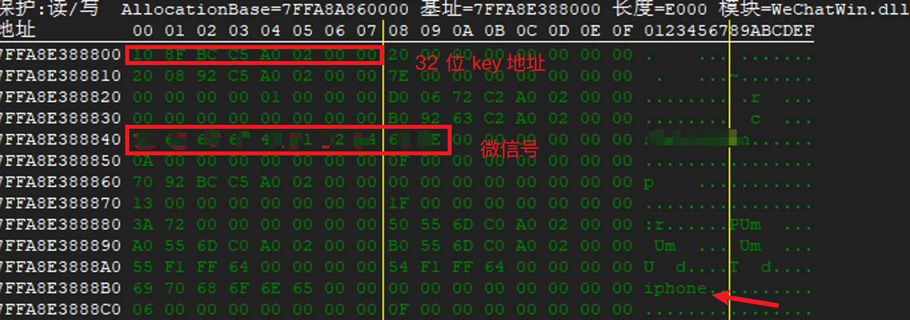
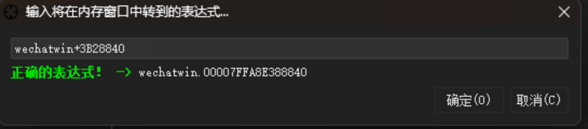
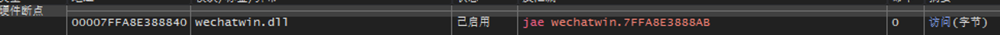
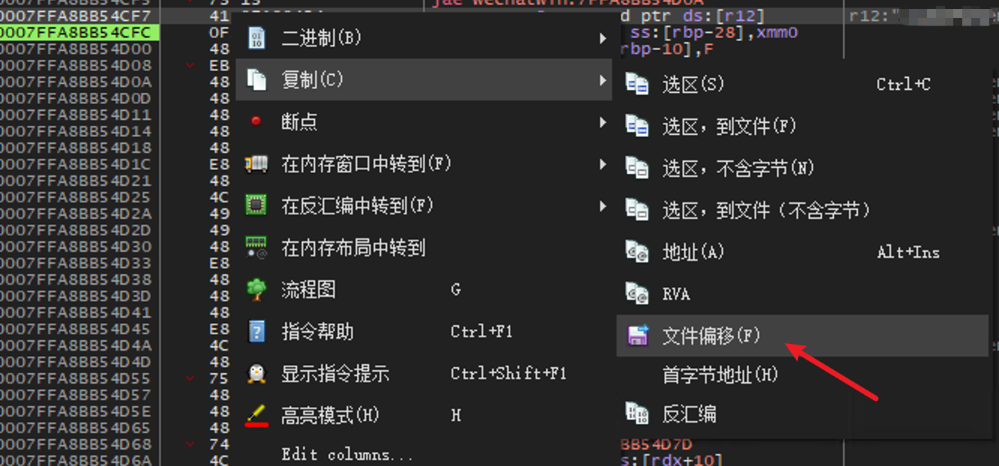
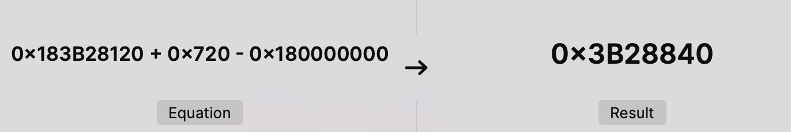
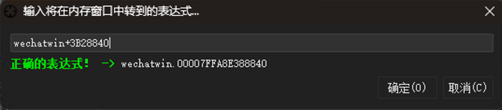
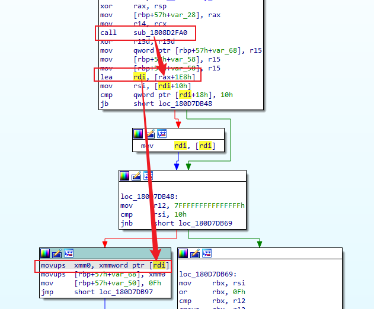

# wechat-dump-rs

该工具用于导出正在运行中的微信进程的 key 并自动解密所有微信数据库文件以及导出 key 后数据库文件离线解密。

> **可能存在封号风险，后果自负！！！**

## 工具用法

```bash
wechat-dump-rs (1.0.3) - REinject
A wechat db dump tool
Options:
  -p, --pid <PID>        pid of wechat
  -k, --key <KEY>        key for offline decryption of db file
  -f, --file <PATH>      special a db file path
  -d, --data-dir <PATH>  special wechat data dir path (pid is required)
  -o, --output <PATH>    decrypted database output path
  -h, --help             Print help
```

如果不带任何参数，程序只输出所有微信进程的 key、微信号、登录设备、数据目录、版本等信息：

```bash
=======================================
ProcessId: 12768
WechatVersion: 3.9.7.25
AccountName: nihao123
PhoneType: iphone
DataDir: C:\Users\test\Documents\WeChat Files\wxid_uy9q2sudtiqv22
key: b16aa99b8e8323f6bb0ebf2ef83ff88f2e47d86d913345933a7168d55aa7e362
=======================================
```

使用参数 `-a` 可以直接导出所有数据库文件。

## 原理

一般情况下，key 要在运行的微信进程内存中拿到，内存偏移在每个版本都不一样，大部分工具是对每个版本维护一套偏移，但是当出现新版本的时候都要重新找偏移，方法见后面有简单记录。

其实，除了这个方法外，还有一个更通用的方法就是内存暴力搜索找到能用于解密的密钥位置，当然如果对进程全部内存扫一遍肯定不行，所以项目里用下面这种方式缩小密钥内存范围加快扫描速度：

1. 微信登录设备类型基本只有 iphone、android，在内存中先搜到设备类型所在内存，key 就在它的前面，向前搜就行
2. key 的内存地址和登录设备类型据我观察是 16 字节对齐的，所以每次向前 16 字节

还有其它一些小细节，直接看一下代码吧。

## 已测试版本列表

其它未测试版本不代表不能用，这个列表只是我本地有过的环境。

- 3.9.6.33
- 3.9.7.25
- 3.9.7.29
- 3.9.8.9
- 3.9.8.15
- 3.9.10.19
- 3.9.11.25
- 3.9.12.15
- 3.9.12.17

## 如何手动寻找偏移

> 注意：我找的偏移不是其他人找的直接的内存偏移，而是微信的一个数据结构相对偏移，这个有什么用呢，我刚开始打算通过 yara 扫 `WeChatWin.dll` 二进制文件确定一个相对偏移，然后根据内存中找到的设备类型地址就能直接推算出其它数据的内存地址，通不通用的关键就在于 yara 了，我没写出通用的，所以才改成了上面的思路。

使用 CheatEngine 在内存中搜索找到 key 或微信号的内存地址，必须是在 `WeChatWin.dll` 内存范围内，然后使用 x64dbg 动态调试，在 key 地址下硬件内存访问断点，之后登录微信后可中断到一个地方，然后一直向上回溯可以找到偏移。

以微信号为例，在 CE 中搜索，我这里使用第二个地址，因为它和 key 的位置比较近：




在 x64dbg 中跳过去



加个硬件访问断点



然后会自动断下或者需要重启后重新登录断下，`r12` 寄存器当前地址就是微信号所在地址：


在这个指令这里右键复制文件偏移，在 ida 中打开 `wechatwin.dll` 跳转过去：



之后，到 ida 可以很明显看到 `r12` 的地址来自于 `sub_1808D2FA0：`


在 `sub_1808D2FA0` 的最后可以拿到一个地址 `183B28120` ：


`183B28120` + `720` - `180000000` = `3B28840`



在 x64dbg 中就可以根据这个文件偏移明确找到微信号的位置，和最初 CE 里搜到的地址一致：



通过同样的方式，分别找到 nickname、phone、key 的相对偏移。

nickename：`183B28120` + `1E8` - `180000000` = `3B28308`


