# 微信3.9手动寻找偏移

> 注意：我找的偏移不是其他人找的直接的内存偏移，而是微信的一个数据结构相对偏移，这个有什么用呢，我刚开始打算通过 yara 扫 `WeChatWin.dll` 二进制文件确定一个相对偏移，然后根据内存中找到的设备类型地址就能直接推算出其它数据的内存地址，通不通用的关键就在于 yara 了，我没写出通用的，所以才改成了上面的思路。

使用 CheatEngine 在内存中搜索找到 key 或微信号的内存地址，必须是在 `WeChatWin.dll` 内存范围内，然后使用 x64dbg 动态调试，在 key 地址下硬件内存访问断点，之后登录微信后可中断到一个地方，然后一直向上回溯可以找到偏移。

以微信号为例，在 CE 中搜索，我这里使用第二个地址，因为它和 key 的位置比较近：

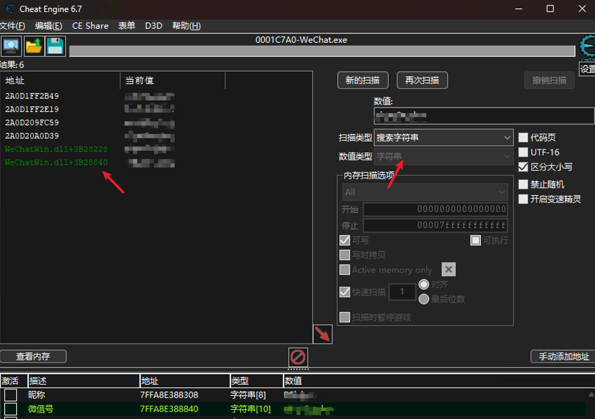
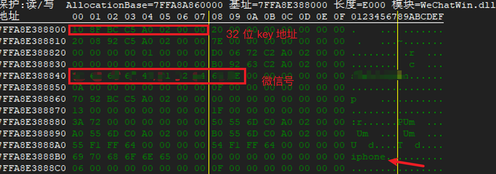

在 x64dbg 中跳过去

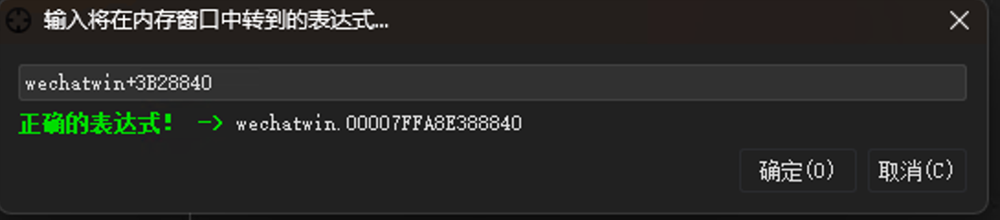

加个硬件访问断点

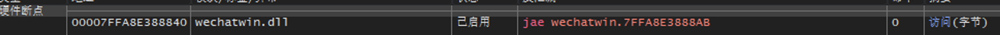

然后会自动断下或者需要重启后重新登录断下，`r12` 寄存器当前地址就是微信号所在地址：

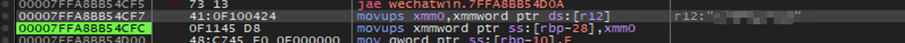

在这个指令这里右键复制文件偏移，在 ida 中打开 `wechatwin.dll` 跳转过去：

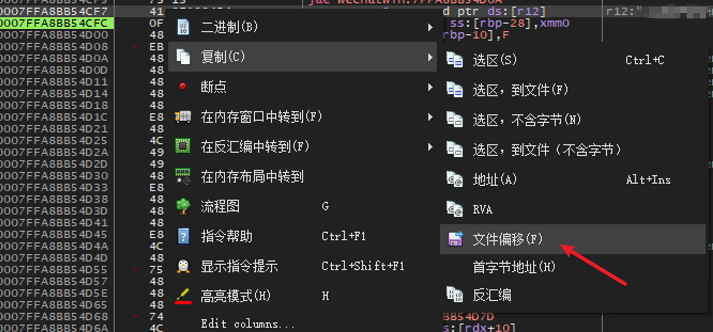

之后，到 ida 可以很明显看到 `r12` 的地址来自于 `sub_1808D2FA0：`

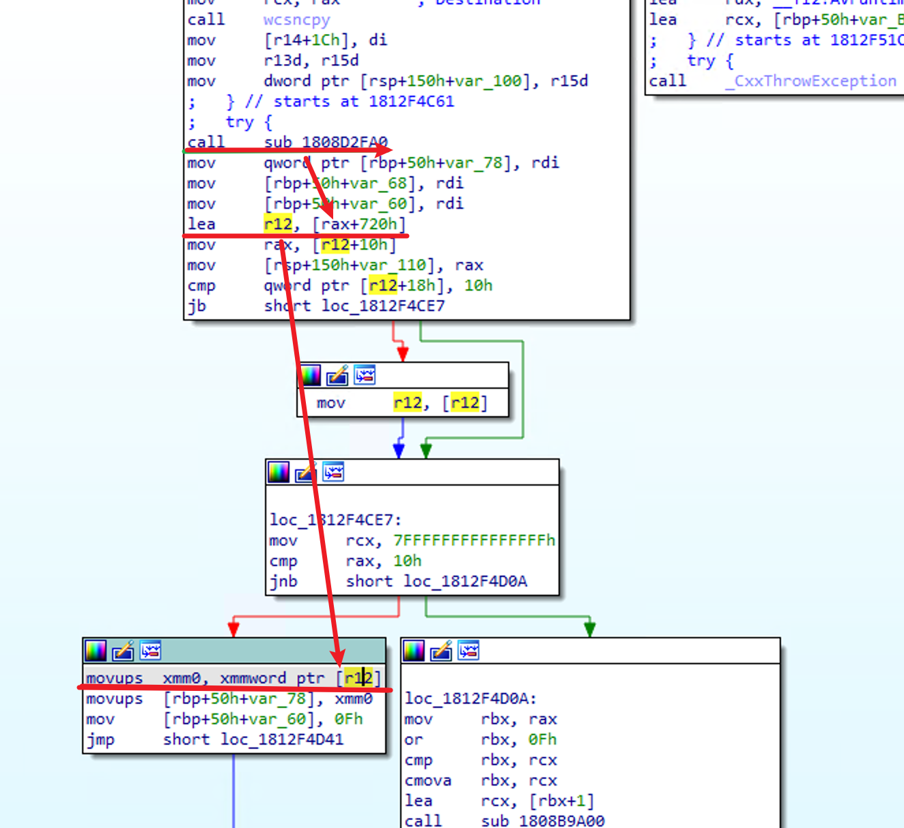

在 `sub_1808D2FA0` 的最后可以拿到一个地址 `183B28120` ：

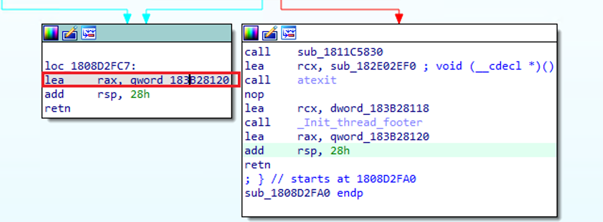

`183B28120` + `720` - `180000000` = `3B28840`

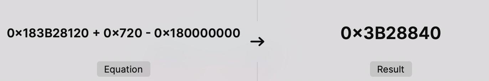

在 x64dbg 中就可以根据这个文件偏移明确找到微信号的位置，和最初 CE 里搜到的地址一致：

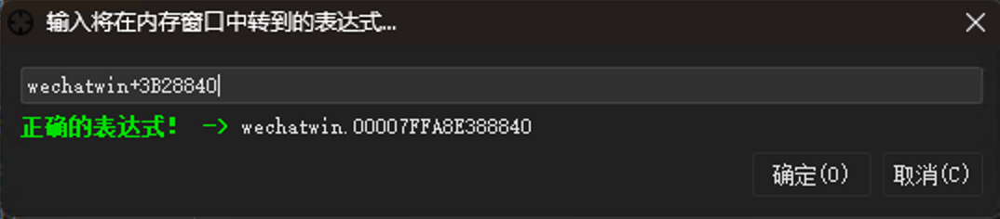

通过同样的方式，分别找到 nickname、phone、key 的相对偏移。

nickename：`183B28120` + `1E8` - `180000000` = `3B28308`

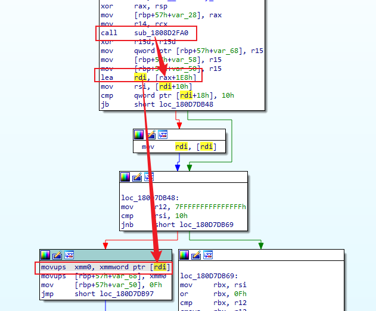
