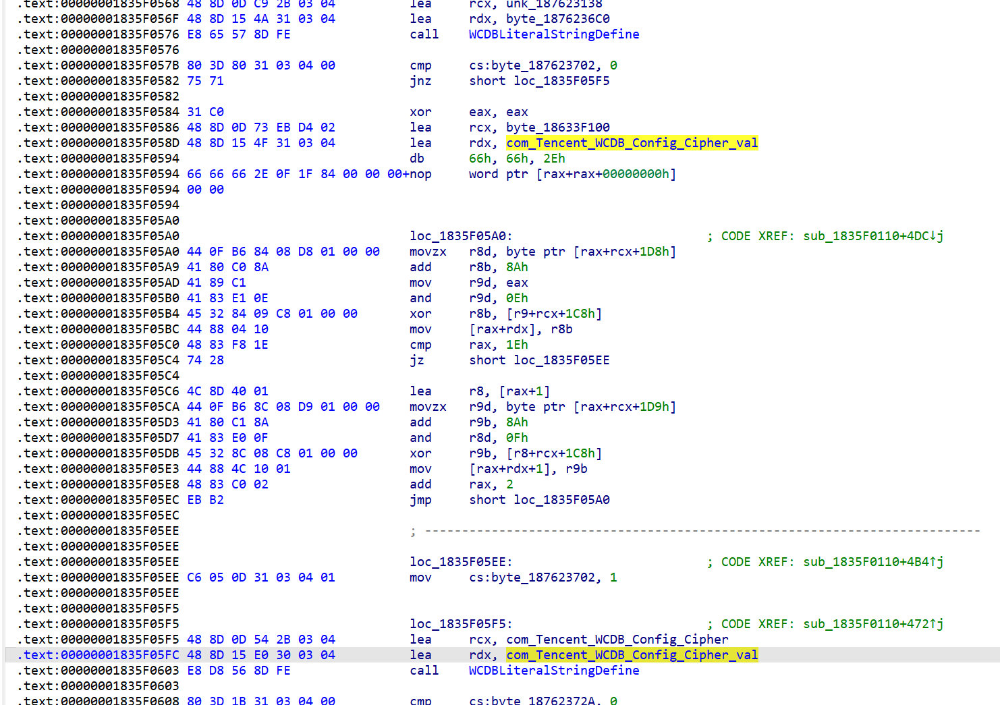

# 微信4.0分析

要定位 key 的位置之前肯定先要找到真实的 key ，下面简单记录一下寻找过程。使用微信版本 4.0.0.26 进行分析。

数据文档存储位置发生变化：`C:\Users\xxx\Documents\xwechat_files\wxid_xxxxx\db_storage`，且不可修改。

进程名从 Wechat.exe 变化为 Weixin.exe，关键 DLL 从 WeChatWin.dll 变化为 Weixin.dll，微信将很多库静态编译成这1个文件所以很大，IDA打开都要解析很久才行。

先说一下取巧的简单办法，根据之前版本微信找 key 经验，可以使用 CE 在内存中搜索 `SetDBKey` 就可以定位到一个日志打印的位置，这个位置所在的函数就是 `SetDBKey` 函数，第二个参数就是 key 指针。（ps：可以观察一下指针周围有什么可以用于定位的特征）

下面说复杂方法，因为微信使用的是 [WCDB](https://github.com/Tencent/wcdb/)，WCDB 算是 sqlcipher 和 sqlite 定制，所以根据 [https://github.com/Tencent/wcdb/wiki/C++-加密与配置](https://github.com/Tencent/wcdb/wiki/C++-加密与配置) 可知微信内部应该需要调用 `setCipherKey` 进行加密配置，所以如果能定位到这个函数就可以找到 key。

直接定位这个函数尝试了下并不好找，另外Weixin.dll里的一些代码还是混淆的，但还是要往简单了想，继续找特征字符串定位一些关键函数，通过看源码找 `setCipherKey` 调用的函数，一层层向下找一直找到一个能定位的位置然后倒推回来。如果实在没办法定位它，就尝试定位它附近的函数，一般编译后也都在一起。

大致思路是这样。实际过程中，我先去找 [`sqlite3_exec`](https://github.com/sqlite/sqlite/blob/7b32f84ebf5cf6ff0515a124abbc028e5890a6bc/src/legacy.c#L30) 去了，想看一下微信执行的 sql 语句，

按上面思路对 `sqlite3_exec` 定位，内部没有明显字符串，比较幸运的是函数开头调用的 [`sqlite3SafetyCheckOk`](https://github.com/sqlite/sqlite/blob/104ab7e81fa819d7e0a9c4232977e2812f358100/src/util.c#L1532) 里面有个字符串 "unopened" 在内存中直接定位到了有且仅有一个的位置 `Weixin.dll+410BDCB`，该位置必然是 `sqlite3SafetyCheckOk`：


转到 IDA 中找所有交叉引用，只有 52 个，可以挨个看过去：


在里面找到最像 `sqlite3_exec` 的：


然后对照源码将 sqlite3_exec 调用的函数一一定位，还可以找到几个比较关键的函数：

- [`sqlite3_prepare_v2`](https://github.com/sqlite/sqlite/blob/104ab7e81fa819d7e0a9c4232977e2812f358100/src/prepare.c#L934)
- [`sqlite3_column_count`](https://github.com/sqlite/sqlite/blob/104ab7e81fa819d7e0a9c4232977e2812f358100/src/vdbeapi.c#L1249)
- [`sqlite3_column_name`](https://github.com/sqlite/sqlite/blob/104ab7e81fa819d7e0a9c4232977e2812f358100/src/vdbeapi.c#L1532)
- [`sqlite3_column_text`](https://github.com/sqlite/sqlite/blob/104ab7e81fa819d7e0a9c4232977e2812f358100/src/vdbeapi.c#L1398)

然后找到这几个又能找出一片，不一一列举了。

现在在 windbg 里对 `sqlite3_exec` 下断点，监控后发现和想象中的不一样，只有一两个固定的语句经过 `sqlite3_exec` 执行：

```sql
0:059> bp weixin+0x4602e50 ".printf \"%ma\\n\", rdx;"
0:059> g
ModLoad: 00007ff9`78030000 00007ff9`780b3000   C:\Windows\System32\fwpuclnt.dll
ModLoad: 00007ff9`78360000 00007ff9`7836a000   C:\Windows\System32\rasadhlp.dll
SELECT name, rootpage, sql FROM "main".sqlite_master ORDER BY rowid
Weixin!GetHandleVerifier+0x3c40f90:
00007ff8`d0d22e50 4157            push    r15
0:021> g
SELECT name, rootpage, sql FROM "main".sqlite_master ORDER BY rowid
Weixin!GetHandleVerifier+0x3c40f90:
00007ff8`d0d22e50 4157            push    r15
0:021> g
SELECT name, rootpage, sql FROM "main".sqlite_master ORDER BY rowid
Weixin!GetHandleVerifier+0x3c40f90:
00007ff8`d0d22e50 4157            push    r15
```

所以微信并不直接通过 `sqlite3_exec` 执行 sql，此时对 `sqlite3_prepare_v2` 下断比较有用，基本执行的所有语句都会经过这个函数：

```sql
0:025> g
SELECT name, rootpage, sql FROM "main".sqlite_master ORDER BY rowid
Weixin!GetHandleVerifier+0x3746d00:
00007ff8`d0828bc0 4883ec38        sub     rsp,38h
0:025> g
PRAGMA checkpoint_fullfsync = TRUE
Weixin!GetHandleVerifier+0x3746d00:
00007ff8`d0828bc0 4883ec38        sub     rsp,38h
0:025> g
PRAGMA temp_store = 1
Weixin!GetHandleVerifier+0x3746d00:
00007ff8`d0828bc0 4883ec38        sub     rsp,38h
0:025> g
PRAGMA cipher_compatibility = 4
Weixin!GetHandleVerifier+0x3746d00:
00007ff8`d0828bc0 4883ec38        sub     rsp,38h
0:025> g
PRAGMA cipher_page_size = 4096
Weixin!GetHandleVerifier+0x3746d00:
00007ff8`d0828bc0 4883ec38        sub     rsp,38h
0:025> g
PRAGMA journal_mode
Weixin!GetHandleVerifier+0x3746d00:
00007ff8`d0828bc0 4883ec38        sub     rsp,38h
0:025> g
SELECT name, rootpage, sql FROM "main".sqlite_master ORDER BY rowid
Weixin!GetHandleVerifier+0x3746d00:
00007ff8`d0828bc0 4883ec38        sub     rsp,38h
0:025> g
PRAGMA checkpoint_fullfsync = TRUE
Weixin!GetHandleVerifier+0x3746d00:
00007ff8`d0828bc0 4883ec38        sub     rsp,38h
```

可以看到一些 sqlcipher 配置参数：

```sql
PRAGMA journal_mode
PRAGMA cipher_compatibility = 4
PRAGMA cipher_page_size = 4096
PRAGMA checkpoint_fullfsync = TRUE
PRAGMA temp_store = 1
```

根据 `cipher_compatibility = 4` 可知新版微信使用的是 sqlcipher4，其他参数没怎么变基本默认。然后这时候已经可以使用之前快速方法找到的 key 尝试解开数据库了。

通过这个函数能观察到要执行的所有语句，但是并不能拿到执行结果。比如期间看到一个比较有意思的查询语句想看一下查询结果：

```sql
SELECT 1 FROM main.LoginKeyInfoTable LIMIT 1
PRAGMA main.table_info('LoginKeyInfoTable')
CREATE UNIQUE INDEX IF NOT EXISTS LoginKeyInfoTable_USER_KEYINFO ON LoginKeyInfoTable(user_name_md5, key_info_md5)
COMMIT
SELECT user_name_md5, key_md5, key_info_md5, key_info_data FROM main.LoginKeyInfoTable WHERE user_name_md5 == '963a71084510983d212311f24bfdea5a9d' ORDER BY rowid DESC LIMIT 1
```

此时需要监控 `sqlite3_column_text`，从返回值中就可以拿到每列值内容：

```plain
0:021> g
SELECT user_name_md5, key_md5, key_info_md5, key_info_data FROM LoginKeyInfoTable WHERE user_name_md5 == '963a71084510983d212311f24bfdea5a9d' ORDER BY rowid DESC LIMIT 1
Weixin!GetHandleVerifier+0x3746d00:
00007ff8`d0828bc0 4883ec38        sub     rsp,38h
0:016> bp weixin+4107110
0:016> g
Breakpoint 1 hit
Weixin!GetHandleVerifier+0x3745250:
00007ff8`d0827110 56              push    rsi
0:016> gu;da rax
00000237`74852030  "963a71084510983d212311f24bfdea5a9d"        // user_name_md5
00000237`74852050  ""
0:016> g
Breakpoint 1 hit
Weixin!GetHandleVerifier+0x3745250:
00007ff8`d0827110 56              push    rsi
0:016> gu;da rax
00000237`7484b460  ""                                          // key_md5
0:016> g
Breakpoint 1 hit
Weixin!GetHandleVerifier+0x3745250:
00007ff8`d0827110 56              push    rsi
0:016> gu;da rax
00000237`7484b910  "6d4196fc4b3183a88692bde4e82966db"           // key_info_md5
00000237`7484b930  ""
```

但是你会发现拿不到 `key_info_data` 值，因为它是 BLOB 类型，`sqlite3_column_text` 只能看到 TEXT 类型值，所以对于不同的值需要监控不同的 sqlite3 接口：

```plain
bp weixin+4108bc0 ".printf \"%ma\\n\", rdx;"
bp weixin+4602e50 ".printf \"%ma\\n\", rdx;"
bp weixin+4106f30
bp weixin+4107010 "gu;db rax;"
bp weixin+4107040 "gu;db rax;"
bp weixin+4107070
bp weixin+41070B0
bp weixin+41070E0
bp weixin+4107110
bp weixin+4107140
```

刚开始我以为这个 `key_info_data` 里就是 db key，发现并不是，login key 和 db key 是不一样的，login key 每次登录都会变化，db key 重新登录不会变。

此时已经扯远了，继续想办法定位 `setCipherKey`。

[`setCipherKey`](https://github.com/Tencent/wcdb/blob/767e092acf914756a2827abc1ca7c4a8395aa67d/src/cpp/core/Database.cpp#L442) 中实际调用的是 `innerDatabase->setConfig`：

```c++
void Database::setCipherKey(const UnsafeData& cipherKey, int cipherPageSize, CipherVersion cipherVersion)
{
    if (cipherKey.size() > 0) {
        m_innerDatabase->setConfig(
        CipherConfigName,
        std::static_pointer_cast<Config>(std::make_shared<CipherConfig>(
        cipherKey, cipherPageSize, cipherVersion)),
        Configs::Priority::Highest);
    } else {
        m_innerDatabase->removeConfig(CipherConfigName);
    }
}
```

我注意到传给 `setConfig` 的第一个参数是 [`CipherConfigName`](https://github.com/Tencent/wcdb/blob/767e092acf914756a2827abc1ca7c4a8395aa67d/src/common/core/CoreConst.h#L80)，它是一个定值：`com.Tencent.WCDB.Config.Cipher`，在 [`CoreConst.cpp`](https://github.com/Tencent/wcdb/blob/767e092acf914756a2827abc1ca7c4a8395aa67d/src/common/core/CoreConst.cpp#L47) 中被初始化。

该字符串在内存中有且仅有一处：


由此在 IDA 中找到对应位置在 `.data` 区域：


交叉引用只有2处，实际是在一起，该位置就是 `CoreConst` 文件范围，可以看到我标记的 `com_Tencent_WCDB_Config_Cipher` 才是真正的全局变量 `CipherConfigName`：



然后找它的交叉引用，也仅有4处而已：


因为 c++ 类调用的原因，调用 `setConfig` 时，`CipherConfigName` 实际是第二个参数，也就是说和 `RDX` 有关，从上图也能直观看出来只有2处引用和该寄存器有关，这里代码有点被混淆，看了下基本确定第1处为 `setConfig` 调用：


在 windbg 中此位置下断后，找到 `setCipherConfig` 函数位置为 `Weixin+1ed3f30`，根据 `setCipherConfig` 源码可知，`const UnsafeData& cipherKey` 存储在 `RDX` 中，后传给了 `R14` 保存，所以从 `R14` 中就可以读取到 key 值：

```plain
0:021> db poi(r14+8) L20
0000023f`0ea53fc0  f2 2e d9 3b 4f 3f 48 3f-9e 2e 14 dd a9 30 bb f2  ...;O?H?.....0..
0000023f`0ea53fd0  0f bc e4 17 69 8b 3a 17-b7 b4 3e 09 58 9a d4 1c  ....ikJ'....H...
```
